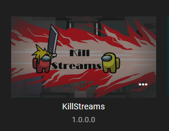
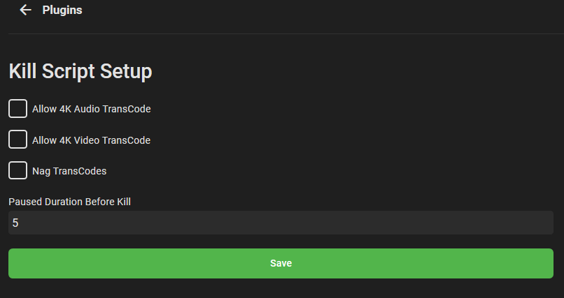
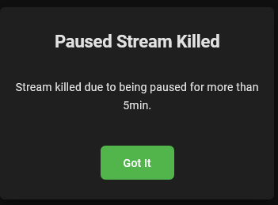
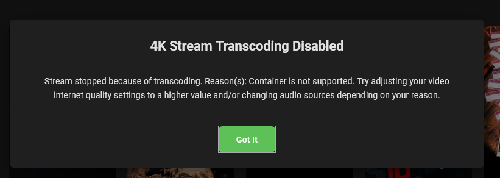
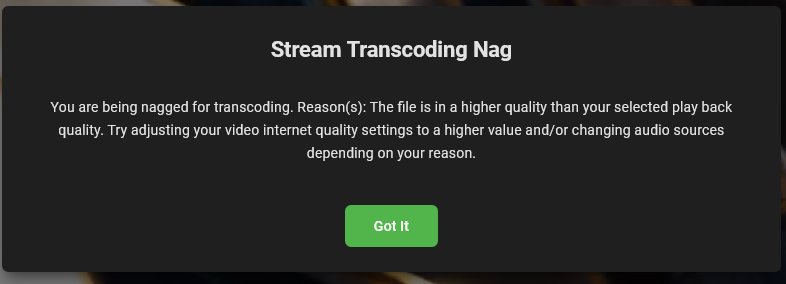

# Emby Kill Streams Plugin
This plugin offers a couple options to kill transcoding 4k streams, streams that have been paused for xx min (set in config), and a fun nag warning to tell users not to transcode if set.

Plugin Image

Config Page

Paused Example

4K Killed Example

4K Killed Example

